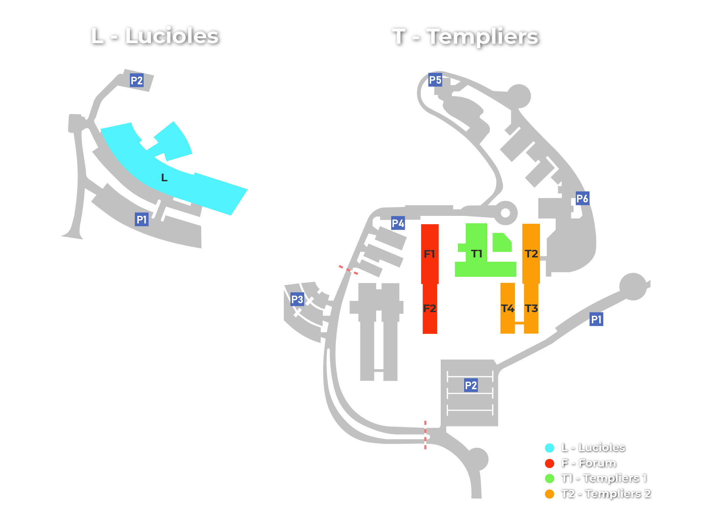
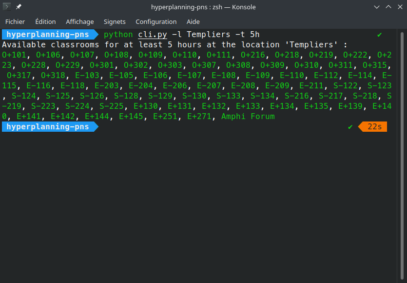
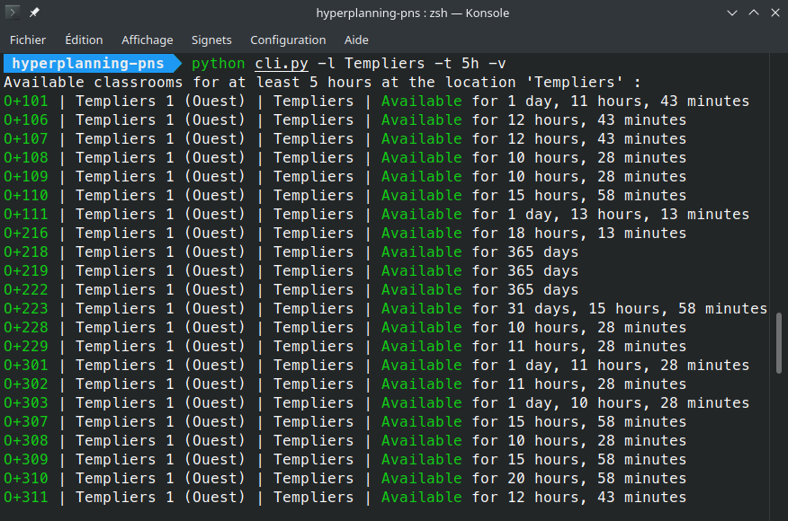
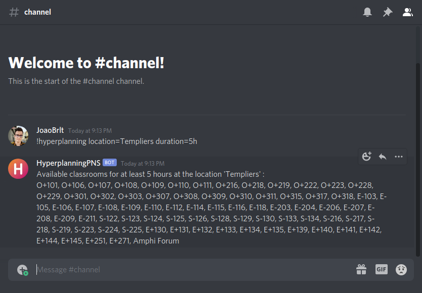
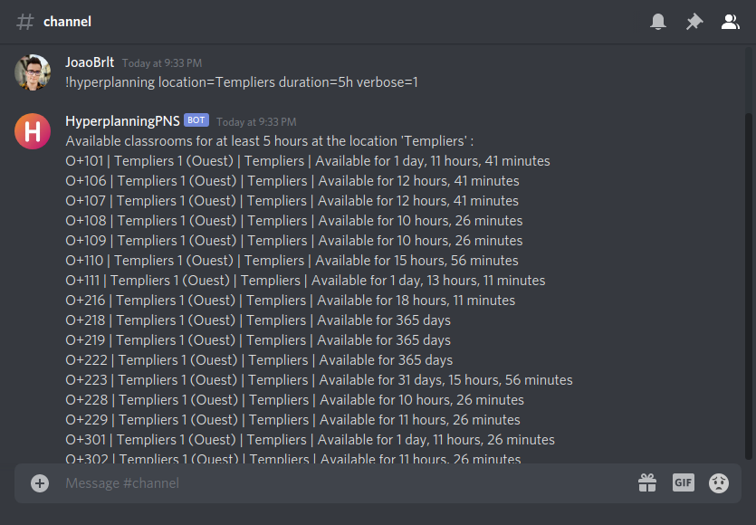

# Hyperplanning PNS

Application for retrieving information about the availability of classrooms at Polytech Nice Sophia using the Hyperplanning system.

## Usage

| Name                                         | Description                                            |
|----------------------------------------------|--------------------------------------------------------|
| [Command-line interface](docs/cli/README.md) | Use the application through a terminal.                |
| [Discord bot](docs/bot/README.md)            | Use the application through the help of a discord bot. |

## Preview

### Command-line interface

### Discord bot

## Contributors

- [João Brilhante](https://github.com/JoaoBrlt)
- [Olivier Doussaud](https://github.com/Dawwen)

## License

This project is licensed under the GPLv3 License - see the [LICENSE.md](LICENSE.md) file for details.