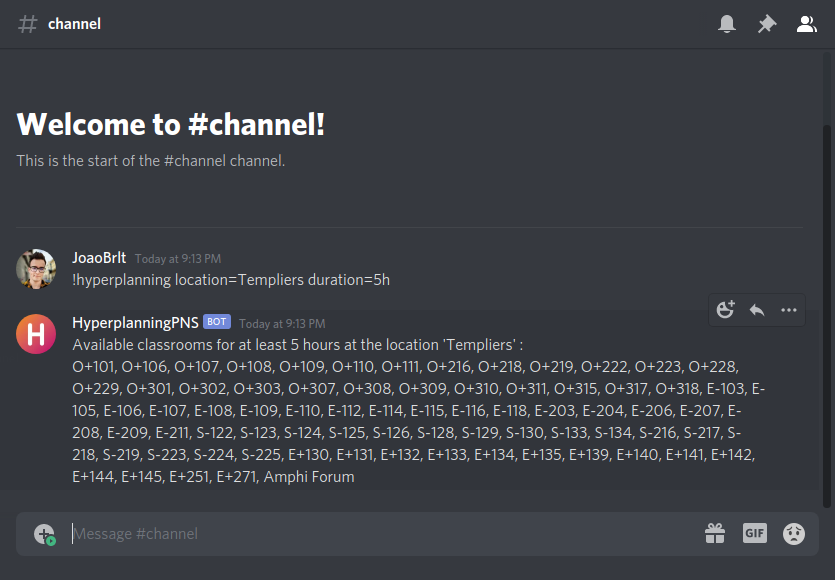

# Discord bot

Use the application through the help of a discord bot.

## Requirements

1. Install Python 3 and pip.
2. Clone the repository.
3. Move to the repository.
4. Install the dependencies.
```bash
pip install -r requirements.txt
```

## Usage
1. Create a Discord application.
2. Create a Discord bot.
3. Copy the Discord bot token.
4. Rename the `.env.example` file to `.env`.
5. Paste the Discord bot token inside the `.env` file.
6. Add the bot to your Discord server.
7. Run the bot.
```bash
python bot.py
```

## Commands

| Name                                      | Description                                                              |
|-------------------------------------------|--------------------------------------------------------------------------|
| !help                                     | Shows the help message.                                                  |
| [!hyperplanning](hyperplanning/README.md) | Shows a list of available classrooms according to the specified filters. |

## Preview


